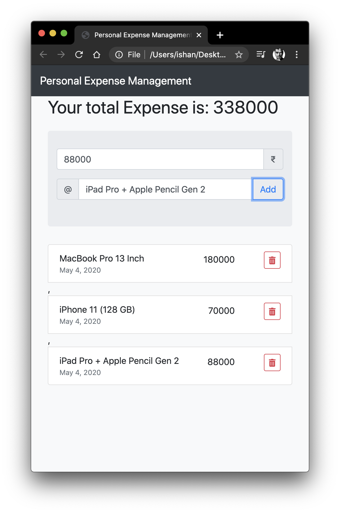

## My first java script Project 

### What it does ??
Its a List where you can add or delete expenses it will show you list of items you have added with their prices 

### How to test it ??
Download the index.html file or you can clone whole repository. Then open the index.html file in any browser and Done !! It will work

### Purpose of this ??
I made this project while learnign the java-script language. So its just for testing purpose. And its totally open sourse.

### ScreenShot

### Sources
Thank You Tanay Pratap sir for making this very interesting tutorial for free on YouTube the link is given below.

https://www.youtube.com/watch?v=C_R6dvU4820&list=PLzvhQUIpvvuj9nN70USkHJrrSeQ9aiqdB
